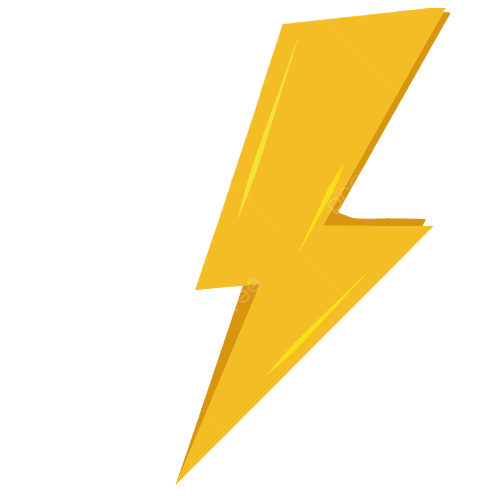

<h1 align='center'>CarGo</h1>

live link: https://cargo-97b35.web.app

server-side-repo: https://github.com/Pinku1211/cargo-server

## Features of the project:
    * The website of a shop of different automobile companies' product.
    * Has dynamic routing 
    * Private routes and access after logged in
    * Firebase authentication and one extra method of log in(google)
    * Dynamic data from database (MongoDB)
    * Logged user can update and add a product to the database and get the UI view
    * Responsible for all types of device out there
    
<h3 align="left">Languages and Tools Used:</h3>

       

